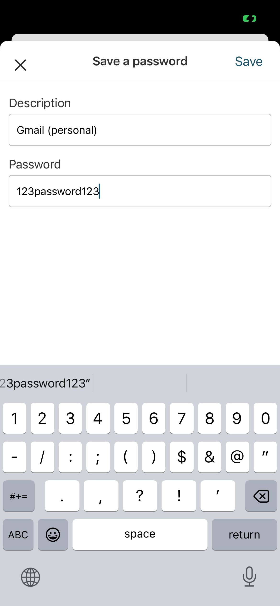
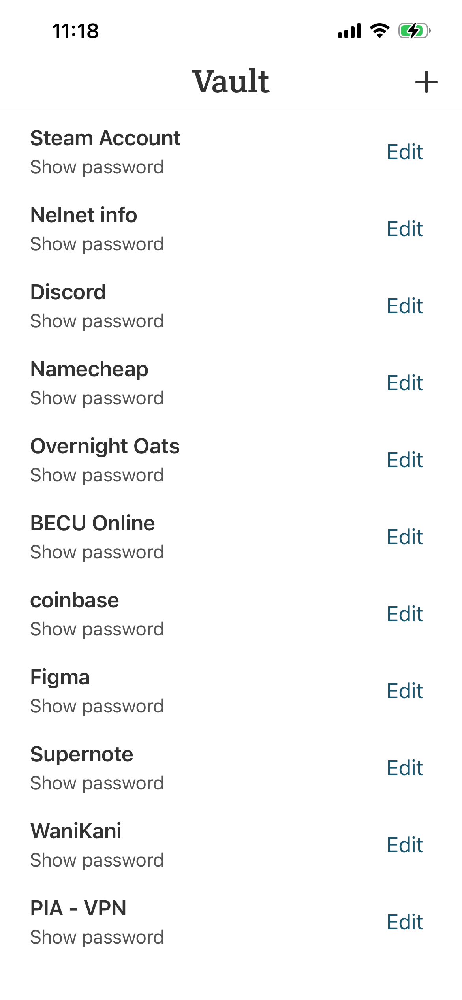
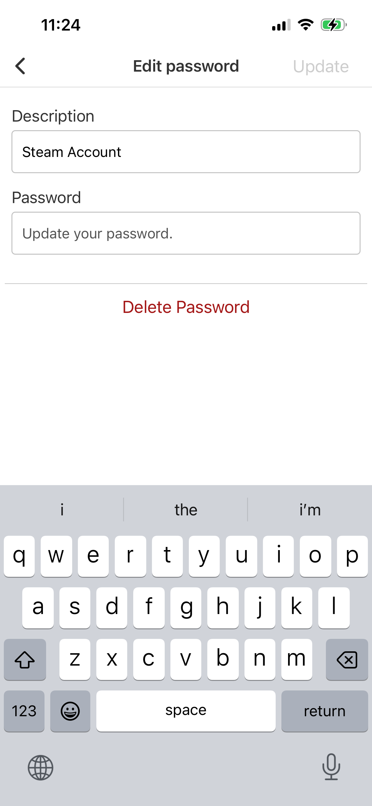
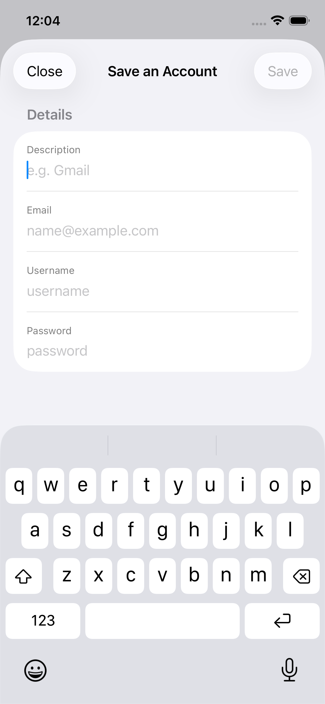
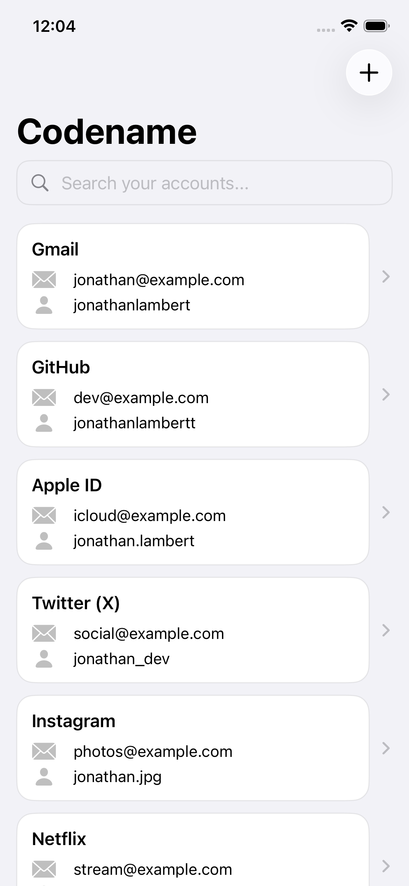
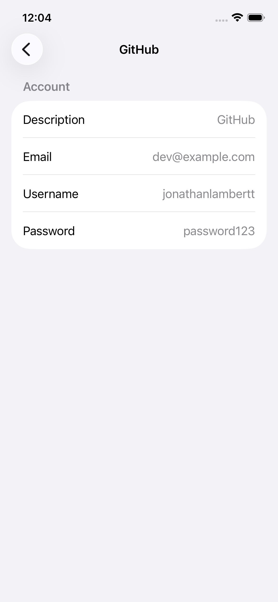

# Vault | Password manager

  
  
  

## My Role

Developer & Designer

## Why I Built This

I built Vault after noticing that my mom frequently lost passwords, reset accounts
multiple times, and relied on writing them down as a workaround. I also needed a
more reliable way to store and manage my own passwords, so I built Vault for both
of us.

## What I Focused On

I wanted saving and viewing passwords to be quick and easy. To save a password,
you only need to provide a description and the password. The home screen displays
all saved passwords, and tapping “Show password” under a description reveals the
password.

## Reflections & Improvements

I’ve learned a lot since starting this project. By examining my mom’s and my own usage, 
talking with my mom, and reflecting on my own pain points, I identified three improvements 
I want to implement and test to improve the app.

### 1. Supporting additional account information beyond passwords

This feature feels obvious to me now, but I didn’t recognize its importance until I began the 
redesign. My own usage of Vault, along with feedback from my mom about wanting to save usernames, 
showed me that storing basic account information, beyond just passwords, is far more useful. This insight 
led me to transition Vault from a simple “password saver” into a more complete account manager.

### 2. Make it easier for users to quickly find and view saved passwords

This is a pain point I’ve experienced many times with the current app. The home screen displays all saved 
passwords in chronological order. When I need a password, I often find myself scrolling through the entire list, 
missing it, and then scrolling back up to find it. Viewing passwords is also inconvenient because I initially styled 
the password text to be less emphasized than its description. 

### 3. Improving support for referencing account information

In addition to requesting the ability to save usernames, my mom has also asked several times for the email associated 
with specific accounts. As saving full accounts has become the main focus, the app’s visual design should evolve to make 
it easier to reference any piece of account information.

## Redesign Screenshots

I’m currently prototyping the features outlined above. The following screens show early explorations of the redesigned experience.

  
  
  

## What the App Supports

- Save passwords with descriptions
- Edit passwords and descriptions
- Delete passwords
